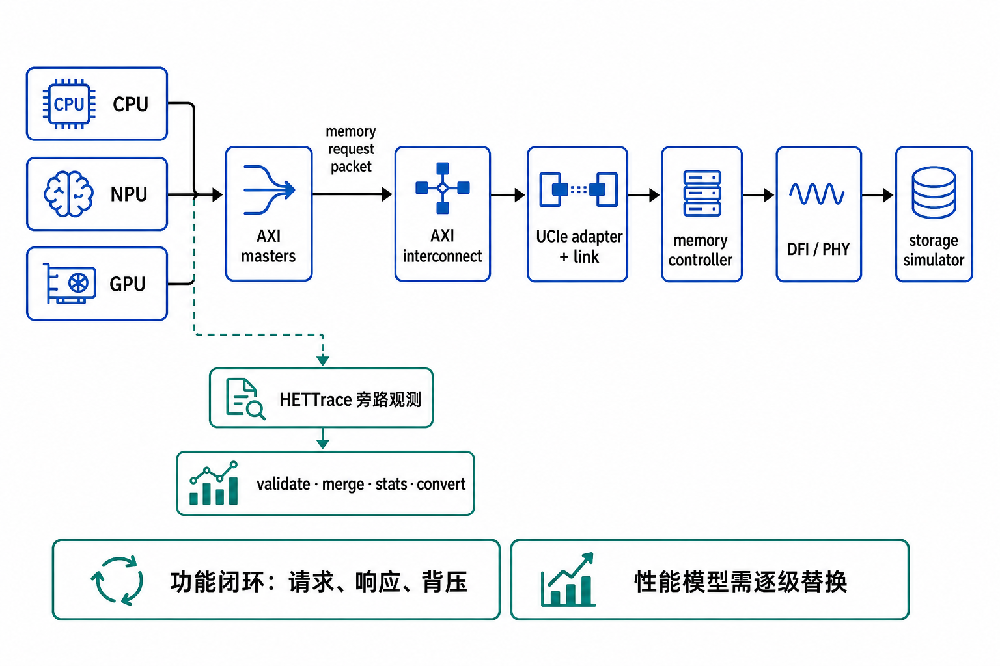

# 阅读说明

本文面向第一次接触本仓库、gem5、AXI 或异构访存 trace 的读者。读完后应当能够：

1. 说清 CPU/NPU/GPU 到存储模拟器的完整路径和每一级职责；
2. 理解 XPU-to-AXI 要交付的信号、握手规则和输入输出；
3. 在当前服务器或等价环境中配置四棵源码树并完成构建；
4. 从功能链自检逐步跑到三源 HETTrace 联合验收；
5. 理解仿真的输入、生成文件、trace 字段和分析工具输出；
6. 判断一次运行是成功、仅有警告，还是数据已经不可用。

本文以仓库 `/home/hy258/zhongxing` 在 **2026-08-22** 的状态为准。更细的设计依据仍以
`README.md`、`UPSTREAM.md`、`docs/01` 至 `docs/04` 以及 `docs/06-storage-chain-plan.md` 为准。

# 项目介绍

## 总体目标

项目的最终目标是对 **CPU + NPU + GPU 共同驱动的存储系统**建模。三类 XPU 产生 AXI
访存请求，请求经过片间链路到达远端内存控制器，最后访问存储模拟器；响应和背压沿原路
返回 XPU。这样既能验证数据是否正确，也能在逐步替换功能占位模块后研究延迟、带宽和争用。

推荐的**目标主链**分层如下图。需要特别注意：标准 DFI 位于 **memory controller 与 DDR PHY
之间**，因此不能把 AXI 先转成标准 DFI、经过 UCIe 后再交给 MC。UCIe 前应是 CXL.mem 或
项目自定义的 memory request packet。

{width=100%}

图中蓝色主路径形成请求、响应和背压的功能闭环；绿色 HETTrace 路径只观察已发生的访问，
不会影响功能链。目前仓库提供了：

- 已完整验收的 CPU/NPU/GPU 访存 HETTrace 前端；
- 可直接运行的 AXI → UCIe 功能链路 → MC → 简化 DFI → memory 最小模型；
- XPU-to-AXI 的接口边界、参考激励和端到端 scoreboard。

`UCIe`、`MC` 和 `DFI` 当前是用于尽早打通接口的功能占位，不代表已经实现协议级、PHY 级或
DRAM 时序级模型。用户负责的 XPU-to-AXI 应首先与这条链路联调，再逐级替换后端。

### “支持全链路仿真”的准确口径

| 问题 | 当前状态 |
|---|---|
| 参考 XPU BFM 从 AXI 边界访问到存储并收到响应 | **支持** |
| burst、WSTRB、ID、RESP、LAST 和读通道背压 | **已验证** |
| 真实 CPU/NPU/GPU master 与三路 AXI 互连驱动后端 | **尚未接入** |
| 标准 UCIe flit/credit/retry 和标准 DFI/PHY | **尚未实现** |
| 真实 MC/DRAM 排队、bank/row/refresh 与性能结果 | **尚未实现** |

因此本报告只使用“**AXI 边界起的功能级全链路仿真**”这一表述。不能把当前状态写成“已经
支持真实 CPU/NPU/GPU 驱动的全链路仿真”，也不能用固定延迟占位模型输出真实性能结论。

## HETTrace 子系统解决的问题

gem5、Vortex SimX 和 CoralNPU 原本是三个独立的仿真组件：

- **gem5** 模拟 x86 host CPU、cache、总线和主存；
- **Vortex SimX** 模拟 RISC-V GPGPU；
- **CoralNPU** 通过 Verilator 运行 NPU RTL 模型。

如果分别运行三个仿真器，各自的时间和地址没有共同含义，无法可靠回答“host 与加速器访问
了哪些相同数据”“多个源的请求如何交错”这类问题。HETTrace 子系统把三者放进同一个 gem5
进程，让它们：

- 使用统一的物理地址图；
- 以 gem5 的 `curTick()` 作为唯一时间基准；
- 分别写出同格式的访存 trace；
- 在仿真结束后离线校验、归并、统计并转换格式。

这里的 **tap** 是只读观察点：它记录访问，但不改变仿真器行为。

## 当前完成度

在本项目定义的范围内，实现和验收已经完成。本次复验结果如下。

| 验证 | 结果 | 主要证明内容 |
|---|---|---|
| `make check` | 通过，234/234 | 地址图生成物同步；Python 工具 164 项；C++ writer 70 项 |
| `run_het.sh` | 通过，4/4 | host 与 CoralNPU 真的共享字节，且反向对照如期失败 |
| `run_vortex_shared.sh` | 通过，5/5 | host runtime、CP、核完整路径；共享 110 条 cache line |
| `run_three_source.sh` | 通过，5/5 | 三源同进程运行、设备区间重叠、19,893 条记录单调归并 |
| `make test-storage-chain` | 通过 | 参考 XPU BFM 的 15 个 AXI beat 在后端功能链闭合；8 写 7 读 |

当前唯一需要单独说明的兼容性缺口是：本机 gem5 是固定的私有 fork。代码分析表明项目未依赖
fork 的额外功能，但纯净上游 gem5 `v25.1.0.1` 尚未实际复验。

## 一句话理解当前 HETTrace 边界

> 地址流可信，跨源先后顺序可信；由设备访存延迟推导出的时间间隔和带宽争用不可信。

HETTrace 能够回答：

- 每个源访问过哪些地址、多少唯一 cache line；
- 哪些 line 被 host、Vortex、CoralNPU 中的多个源共同访问；
- 请求在统一 tick 轴上的跨源交织顺序；
- 如何生成下游 DRAM 模拟器需要的地址与读写序列。

HETTrace 单独不能回答：

- NPU 或 Vortex 的真实内存延迟；
- 三个源竞争同一内存控制器后的真实性能；
- cache 一致性、IOMMU、操作系统和驱动产生的流量；
- “把内存变慢后程序会慢多少”。

原因是设备访问没有闭环反馈到 gem5 的时序内存系统。特别是 CoralNPU 的 AXI master 使用
`physProxy` 功能访问，数据会正确读写，但不会排队和消耗仿真时间。需要时序结论时，应把
trace 交给下游 DRAM 模型重新计算。新增 `storage_chain/` 已经验证功能闭环，但其中固定延迟
占位仍不能代表真实性能。

## 先跑通最小存储链

不安装三棵上游源码，也可以先运行：

```bash
cd /home/hy258/zhongxing
make test-storage-chain
```

测试把 CPU、NPU、GPU 编码为 `AxUSER=0/1/2`，依次验证 burst 写后跨源读回、`WSTRB`
部分写以及 R 通道背压。成功结尾为：

```text
CHAIN PASS: AXI beats=15, UCIe req/rsp=15/15, MC cmds=15, DFI writes/reads=8/7
```

各级计数相等说明没有丢包或重复包；scoreboard 通过说明读写数据、ID、RESP 和 LAST 正确。
这里所说的“全链路”从 AXI 边界开始；测试中的 XPU 是参考 BFM。接入真实 XPU 时，应以其
AXI master 替换 BFM，而保持后端和
scoreboard 不变。

# 新手需要先理解的概念

## host、设备和 SE 模式

**host** 是 gem5 中运行的 x86 程序。项目使用 gem5 的 SE（Syscall Emulation）模式，
gem5 直接模拟用户程序的系统调用，不启动 Linux 内核。因此 trace 中没有内核代码、页表
遍历和真实驱动流量。

**CoralNPU** 和 **Vortex** 是两个设备。host 通过 MMIO/PIO 寄存器启动设备，并通过共享
内存或 BAR 传递数据。

## tick、周期和 tap 层级

gem5 的 `1 tick = 1 ps`，即每秒 `10^12` tick。三个源的标称频率不同：

| 源 | 频率 | 一个周期对应 tick | tap 层级 |
|---|---:|---:|---|
| host | 2000 MHz | 500 | L2/LLC 之后 |
| Vortex | 1000 MHz | 1000 | cache 之后，另含 CP DMA |
| CoralNPU | 500 MHz | 2000 | AXI master |

同一个 `tick` 可以跨源比较先后，但不同 tap 层级的“记录条数”不能直接比较。比如 NPU 在 TCM
中的访问根本不会到 AXI master；host 的 cache 命中也不会穿过 L2 后的 tap。

## 两种共享方式

host 与 CoralNPU 是直接共享：双方访问 gem5 中 `shared_buffer` 的同一批字节。

host 与 Vortex 是中转共享：host 先访问 BAR 顶部暂存区，Vortex 的命令处理器（CP）再把
字节搬到设备缓冲。Vortex trace 中带 `kFlagDma` 的记录正是这段中转。若只记录 GPU 核的
访问，会出现“计算正确但共享 line 为 0”的假象。

Vortex 与 CoralNPU 不能直接共享：Vortex BAR 位于 4 GiB 以上，而 CoralNPU 的 AXI 地址只有
32 位。两设备交换数据必须由 host 中转。这是地址宽度导致的结构限制，不是待办项。

# 仓库结构

| 路径 | 新手应如何理解 |
|---|---|
| `addrmap.json` | 统一地址图的唯一手写真值源 |
| `scripts/gen_addrmap.py` | 从地址图生成 C++/Python 常量并检查同步性 |
| `libhettrace/` | 二进制 trace 格式和 C++ writer |
| `tools/hettrace/` | Python 离线工具：校验、归并、统计、查看、转换 |
| `gem5int/` | gem5 设备、host tap、配置脚本和验收脚本 |
| `vortexint/` | Vortex tap、安装脚本和 5 个补丁 |
| `coralnpuint/` | CoralNPU ABI、tap、验证内核和 2 个补丁 |
| `storage_chain/` | AXI 接入边界、UCIe/MC/DFI/memory 功能占位和自检 testbench |
| `workloads/` | host+NPU、Vortex smoke、三源联合负载 |
| `UPSTREAM.md` | 已验证的上游 commit 与工具版本 |
| `docs/` | 地址、格式、限制、集成、存储链计划和本报告 |

本仓库不是三个上游项目的 fork。`gem5int/`、`vortexint/` 和 `coralnpuint/` 中的安装脚本
会把新增文件和补丁安装到各自的上游树。

# 环境与路径配置

## 当前服务器上的推荐路径

```bash
export PROJ=/home/hy258/zhongxing
export GEM5_HOME=/home/hy258/gem5
export VORTEX_HOME=/home/hy258/vortex-gpu/vortex
export VORTEX_BUILD=/home/hy258/vortex-gpu/vxbuild
export CORALNPU_HOME=/home/hy258/coralnpu

cd "$PROJ"
```

变量含义：

| 变量 | 指向的内容 |
|---|---|
| `PROJ` | 本项目根目录 |
| `GEM5_HOME` | gem5 源码树 |
| `VORTEX_HOME` | Vortex 源码树 |
| `VORTEX_BUILD` | Vortex 的 out-of-tree 构建目录，不要放 `/tmp` |
| `CORALNPU_HOME` | CoralNPU 源码树 |

这些变量只在当前 shell 生效。新开终端后要重新设置，或者写入个人 shell 配置。不要把 token、
license 或其他凭据写进仓库。

## 已验证的版本

| 组件 | 已验证版本/commit |
|---|---|
| OS | Ubuntu 24.04.4 LTS |
| gem5 | `2721ed751edac7d4cf3df574c6e0293343a14ba2` |
| Vortex | `d76b7f24e658867ab57e3942d7c648c3e6af072d`（v3.0） |
| CoralNPU | `fcb74cfe79dbd184b9c53539490994e701981f80` |
| gcc/g++ | 13.3.0 |
| Python | gem5 构建使用 3.12.3；离线工具支持 3.8.20 |
| Bazel | 8.6.0 |
| Verilator | 5.020 |
| Vortex LLVM 工具链 | v3.0，安装于 `$HOME/tools` |

不要从“最新 commit”开始排错。先用 `UPSTREAM.md` 固定的版本跑通，再评估升级。可用以下命令
核对三棵树：

```bash
for d in "$GEM5_HOME" "$VORTEX_HOME" "$CORALNPU_HOME"; do
    printf '%-40s %s\n' "$d" "$(git -C "$d" rev-parse HEAD)"
done
git -C "$VORTEX_HOME" submodule status
```

## 先做不依赖仿真器的检查

```bash
cd "$PROJ"
make check
```

正确结果应包含：

```text
addrmap: 生成文件与 addrmap.json 同步
hettrace tools: 164 项检查, 0 项失败 (21 个用例)
libhettrace: 70 项检查, 0 项失败
```

如果这一步失败，先不要构建三个大项目。地址生成物不同步或工具自测失败，会让后续问题更难
定位。

# 安装与构建

## 把集成代码安装进三棵上游树

在本项目根目录执行：

```bash
GEM5_HOME="$GEM5_HOME" ./gem5int/install.sh
VORTEX_HOME="$VORTEX_HOME" ./vortexint/install.sh
CORALNPU_HOME="$CORALNPU_HOME" ./coralnpuint/install.sh

# 顺序不能反：先补丁 Vortex，再把 Vortex 的 gem5 侧代码装入 gem5。
GEM5_HOME="$GEM5_HOME" "$VORTEX_HOME/sim/simx/gem5/install.sh"
```

三个项目安装脚本都可重复运行，也支持 `--revert`。安装过程会新增目录并修改 7 个必须打补丁
的上游文件。若补丁因上游漂移无法应用，不要强行忽略，应按 `docs/04-integration.md` 重新生成
相应补丁。

## 构建 gem5

```bash
"$GEM5_HOME/.venv/bin/scons" -C "$GEM5_HOME" \
    build/X86/gem5.opt -j"$(nproc)"
```

如果 `.venv` 不存在：

```bash
/usr/bin/python3 -m venv "$GEM5_HOME/.venv"
"$GEM5_HOME/.venv/bin/pip" install -r "$GEM5_HOME/requirements.txt"
```

构建后检查两个设备参数是否真的进入 gem5：

```bash
grep -n trace_enable "$GEM5_HOME/build/X86/params/CoralNPU.hh"
grep -n trace_enable "$GEM5_HOME/build/X86/params/VortexGPGPU.hh"
```

两个命令都应找到 `trace_enable`。只“编译成功”不代表 Python SimObject 文件安装正确。

## 构建 CoralNPU 设备库和测试内核

```bash
cd "$CORALNPU_HOME"
bazel build //gem5int:libcoralnpu-gem5.so
bazel build //gem5int:ddr_touch.elf
```

主要产物：

- `bazel-bin/gem5int/libcoralnpu-gem5.so`：gem5 动态加载的设备库；
- `ddr_touch.elf`：会真正访问外部 DDR 的验证内核。

`ddr_touch.elf` 可能位于配置化的 `bazel-out` 子目录，而不是与 `.so` 完全相同的路径。查找时
先解析符号链接：

```bash
BAZEL_OUT=$(readlink -f "$CORALNPU_HOME/bazel-out")
find "$BAZEL_OUT" -path '*/gem5int/ddr_touch.elf'
```

## 构建 Vortex

先初始化 Vortex 的依赖：

```bash
cd "$VORTEX_HOME"
git submodule update --init \
    third_party/softfloat third_party/ramulator third_party/cocogfx
make -C "$VORTEX_HOME/third_party" -j"$(nproc)"
```

配置并构建设备库：

```bash
mkdir -p "$VORTEX_BUILD"
cd "$VORTEX_BUILD"
"$VORTEX_HOME/configure" --xlen=32
make -C "$VORTEX_BUILD/sim/simx" USE_GEM5=1 \
    libvortex-gem5 -j"$(nproc)"

nm -D --defined-only \
    "$VORTEX_BUILD/sim/simx/libvortex-gem5.so" \
    | grep vortex_gem5_trace_
```

最后一条命令应看到 `open`、`close`、`emitted` 三个 trace ABI 符号。

host 与 Vortex 的完整共享测试还需要 Vortex LLVM 工具链生成 `.vxbin`。若当前环境没有，按
Vortex 自带脚本安装最小集合：

```bash
mkdir -p /tmp/vortex-toolchain-download
cd /tmp/vortex-toolchain-download
TOOLDIR="$HOME/tools" \
    "$VORTEX_BUILD/ci/toolchain_install.sh" \
    --llvm --libc32 --libcrt32 --riscv32
```

该工具链约 1.6 GB。脚本可能删除 `$TOOLDIR` 下同名组件，执行前先确认目标目录。随后构建
host runtime 和上游 `vecadd`：

```bash
make -C "$VORTEX_BUILD/sw/runtime"
make -C "$VORTEX_BUILD/tests/regression/vecadd"
```

## 构建本项目 workload

```bash
cd "$PROJ"
make -C workloads/shared_buffer
make -C workloads/vortex_smoke
VORTEX_HOME="$VORTEX_HOME" VORTEX_BUILD="$VORTEX_BUILD" \
    make -C workloads/three_source
```

# 推荐的验收顺序

新手不要直接从三源测试开始。按下面顺序逐层增加组件，失败时更容易确定是哪条腿的问题。

## 第 1 层：本仓库自测

```bash
cd "$PROJ"
make check
```

期望：234 项全部通过。

## 第 2 层：单设备冒烟测试

CoralNPU 设备库纯 C ABI 冒烟测试：

```bash
CORALNPU_HOME="$CORALNPU_HOME" coralnpuint/tests/run_smoke.sh
```

CoralNPU 在真正 gem5 事件队列中的单设备测试：

```bash
GEM5_HOME="$GEM5_HOME" CORALNPU_HOME="$CORALNPU_HOME" \
    gem5int/tests/run_gem5_npu.sh
```

Vortex 单设备 tap 测试：

```bash
GEM5_HOME="$GEM5_HOME" VORTEX_HOME="$VORTEX_HOME" \
    gem5int/tests/run_vortex.sh
```

单设备 trace 只有一个源时，`validate` 报“只有 1 个源”是预期提醒：文件本身可以正常解析，
但它不能证明异构共享。

## 第 3 层：host + CoralNPU 主验收

```bash
cd "$PROJ"
GEM5_HOME="$GEM5_HOME" CORALNPU_HOME="$CORALNPU_HOME" \
    gem5int/tests/run_het.sh
```

脚本检查四件事：host/NPU 功能自检、两份 meta 计数、共享 line 和校验、关闭共享后的反向
对照。2026-08-22 的复验结果为：host 1111 条、CoralNPU 128 条、共享 8 条 line，4/4 通过。

## 第 4 层：host + Vortex 主验收

```bash
GEM5_HOME="$GEM5_HOME" VORTEX_HOME="$VORTEX_HOME" \
    gem5int/tests/run_vortex_shared.sh
```

脚本使用 Vortex 上游 `vecadd -n64`，走 `host runtime -> CP -> GPU 核` 的完整路径。
`PASSED!` 说明设备算出的 64 个结果正确；trace 中还必须同时存在核记录和 CP DMA 记录。
本次复验为 host 19,422 条、Vortex 287 条、共享 110 条 line，5/5 通过。

## 第 5 层：三源联合验收

```bash
VORTEX_HOME="$VORTEX_HOME" VORTEX_BUILD="$VORTEX_BUILD" \
    make -C workloads/three_source

GEM5_HOME="$GEM5_HOME" CORALNPU_HOME="$CORALNPU_HOME" \
VORTEX_HOME="$VORTEX_HOME" VORTEX_BUILD="$VORTEX_BUILD" \
    gem5int/tests/run_three_source.sh
```

本次复验结果：

| 源 | 记录数 | 字节数 | 活动区间（tick） |
|---|---:|---:|---|
| host | 19,486 | 717,248 | `[1500, 2374683000]` |
| Vortex | 279 | 17,856 | `[2175760000, 2324172000]` |
| CoralNPU | 128 | 1,280 | `[2292498000, 2294156000]` |

NPU 的 1,658,000 tick 活动区间完全落在 Vortex 区间内。三源共 19,893 条记录，归并后按
`(tick, src_id, seq)` 单调，源切换 76 次。共享 line 为：

- host 与 CoralNPU：8；
- host 与 Vortex：106；
- CoralNPU 与 Vortex：0（结构限制下的正确期望值）。

# 仿真输入：每个参数是什么意思

推荐日常使用验收脚本，因为脚本会自动寻找产物并检查错误。需要运行自定义 workload 时，
直接使用安装后的 `configs/het/het_system.py`。

## 必选和常用输入

| 输入 | 含义 | 典型值 |
|---|---|---|
| `--cmd` | gem5 SE 模式运行的 x86 host 可执行文件，必选 | `workloads/.../host_main` |
| `--options` | 传给 host 程序的参数；以 `-` 开头时写 `--options=-n64` | `-k kernel.vxbin` |
| `--env KEY=VAL` | 被仿真 host 进程的环境变量，可重复 | runtime 自定义变量 |
| `--npu-library` | CoralNPU 设备 `.so`；不提供则不实例化 NPU | `libcoralnpu-gem5.so` |
| `--npu-kernel` | NPU 执行的 RISC-V ELF | `ddr_touch.elf` |
| `--vortex-library` | Vortex SimX gem5 设备 `.so` | `libvortex-gem5.so` |
| `--vortex-host-rt-dir` | 包含两份 Vortex host runtime `.so` 的目录 | `$VORTEX_BUILD/sw/runtime` |
| `--vortex-kernel` | standalone 模式预载的 `.vxbin`，CP runtime 路径通常留空 | `kernel.vxbin` |
| `--num-cpus` | host CPU 上下文数，默认 4 | Vortex runtime 会创建线程 |
| `--max-ticks` | 防止程序跑飞的仿真上限，默认 `10^11` tick | 100 ms 仿真时间 |

## 调试开关

| 开关 | 用途 |
|---|---|
| `--no-host-trace` | 暂停 host tap，区分“系统跑不动”和“trace 写不出” |
| `--host-trace-inst` | 把 host 取指流量也写入 trace；默认关闭 |
| `--npu-auto-start` | 不等 host 写控制寄存器，初始化后直接启动 NPU |
| `--npu-no-share` | 故意切断 NPU 字节共享，用于反向对照，不是正常配置 |
| `--vortex-bar-skew` | 故意错开 BAR，用于验证地址映射判据 |
| `--vortex-trace-dev-view` | 记录 Vortex 设备内地址；此时不能与 host 物理地址直接比较 |

## trace 输出环境变量

三个 tap 的写出行为由环境变量控制：

| 变量 | 默认 | 含义 |
|---|---|---|
| `HETTRACE_DIR` | 未设置 | 输出目录；未设置表示完全关闭 trace |
| `HETTRACE_FORMAT` | `bin` | `bin` 为二进制，`text` 便于人工调试 |
| `HETTRACE_FILTER` | `dram` | `dram` 仅保留内存流量；`all` 也保留其他访问 |
| `HETTRACE_BUFSZ` | `65536` | writer 缓冲的记录条数 |

自定义运行示例：

```bash
TRACE_DIR=$(mktemp -d)
export HETTRACE_DIR="$TRACE_DIR"
export HETTRACE_FORMAT=bin
export HETTRACE_FILTER=dram

"$GEM5_HOME/build/X86/gem5.opt" \
    "$GEM5_HOME/configs/het/het_system.py" \
    --cmd "$PROJ/workloads/shared_buffer/build/host_main" \
    --npu-library "$CORALNPU_HOME/bazel-bin/gem5int/libcoralnpu-gem5.so" \
    --npu-kernel /absolute/path/to/ddr_touch.elf

echo "trace 位于: $TRACE_DIR"
```

`HETTRACE_DIR` 应先创建，且必须让运行进程可写。验收脚本用 `mktemp -d` 自动处理。

# 统一地址图与 workload 输入

## 地址区间

`addrmap.json` 是唯一真值源。修改它后必须运行 `make addrmap` 重新生成 C++ 和 Python 地址
表，并用 `make check-addrmap` 检查同步性。

| 区域 | 基址 | 大小 | 主要访问者 | 含义 |
|---|---:|---:|---|---|
| `boot_rom` | `0x00000000` | 256 MiB | host | 预留/引导 |
| `npu_slave` | `0x10000000` | 256 MiB | host | NPU TCM 与设备库控制窗口 |
| `vortex_cp` | `0x20000000` | 512 B | host | Vortex 命令处理器寄存器 |
| `npu_pio` | `0x30000000` | 4 KiB | host | gem5 CoralNPU 控制/状态寄存器 |
| `host_heap` | `0x80000000` | 256 MiB | host | host 代码、堆、栈所在物理页池 |
| `shared_buffer` | `0x90000000` | 256 MiB | 三方 | host 与 NPU 的直接交接区 |
| `vortex_vram` | `0xa0000000` | 256 MiB | Vortex | 设备内部视角，不是 host 物理内存 |
| `npu_work` | `0xb0000000` | 256 MiB | host/NPU | 权重和 activation 工作区 |
| `npu_mailbox` | `0xc0000000` | 16 B | host/NPU | 4 个 32 位 mailbox |
| `vortex_bar` | `0x100000000` | 4 GiB | host/Vortex | host 看向 Vortex 设备内存的窗口 |

共享区和设备窗口都按 `VA == PA` 映射为 uncacheable。这样 host 的写不会停在 cache 脏行里，
设备能立即读到相同字节；MMIO 也不会被 cache 错误吸收。

## 三个验收 workload 的数据输入

`workloads/shared_buffer/host_main.c` 在 `shared_buffer` 中放置输入数组，启动 NPU，等待完成后
检查输出和 mailbox。`ddr_touch.elf` 会对 64 个输入字执行确定性运算，因此 host 可以验证
每个结果，而不只是检查“设备停了”。

Vortex 的共享验收使用上游 `vecadd -n64`。host runtime 把输入和命令写入 BAR 暂存区，CP
搬到设备缓冲，GPU 核计算后再由 CP 搬回；程序打印 `PASSED!` 才算功能正确。

`workloads/three_source/host_main.cpp` 先异步提交 Vortex 工作，立刻启动 NPU，使两个设备的
活动区间确实重叠。它验证的是三源 trace 的共同时间轴和交织，而不是设备间直接传递结果。

# trace 输出：文件和字段是什么意思

## 输出目录中的文件

典型三源运行结束后：

```text
$HETTRACE_DIR/
├── host.hettrace
├── host.hettrace.meta.json
├── vortex.hettrace
├── vortex.hettrace.meta.json
├── coralnpu.hettrace
├── coralnpu.hettrace.meta.json
├── validate.txt                 # 某些验收脚本保存
└── merged.hettrace              # 三源脚本生成的文本归并结果
```

每个源单独写文件，是为了避免多个回调对同一个文件的写入顺序冒充 tick 顺序。离线 `merge`
可以稳定地按 `(tick, src_id, seq)` 重排。

## 二进制文件头

`.hettrace` 默认是小端二进制：64 字节文件头，随后是若干 32 字节定长记录。

| 字段 | 含义 |
|---|---|
| `magic` / `version` | 格式标识与版本，当前为 v1 |
| `record_size` | 单条记录大小，当前 32 字节 |
| `ticks_per_second` | 固定为 `10^12` |
| `clock_period_ticks` | 本源一个周期对应多少 gem5 tick |
| `src_id` / `name` | 0/host、1/vortex、2/coralnpu |
| `level` | tap 的观察层级 |
| header `flags` | 是否启用默认内存窗口过滤 |

## 单条记录

| 字段 | 示例 | 含义 |
|---|---|---|
| `tick` | `2292498000` | 全局 gem5 tick，不是源内 cycle |
| `addr` | `0x90000000` | 已换算到统一视角的物理地址 |
| `size` | `16` | 本次访问的字节数 |
| `ctx` | `0` | host requestor、Vortex hart 或 NPU AXI id |
| `seq` | `42` | 本源内连续递增的序号，用于排序和检测丢记录 |
| `src_id` | `2` | 记录来自哪个源 |
| `op` | `R`/`W` | 读或写 |
| `flags` | `0x10` | burst、预取、未映射、取指、DMA 等标记 |

flags 位定义：

| 位 | 名称 | 含义 |
|---:|---|---|
| 0 | `kFlagBurstBeat` | AXI burst 的非首拍 |
| 1 | `kFlagPrefetch` | 预取或推测访问 |
| 2 | `kFlagUnmapped` | 地址不属于 `addrmap.json` 的任何区域 |
| 3 | `kFlagInstr` | 取指流量 |
| 4 | `kFlagDma` | Vortex CP 搬运产生的内存访问 |

## meta.json 侧车文件

二进制文件适合机器读取，`meta.json` 适合快速判断 trace 是否健康：

```json
{
  "src_id": 2,
  "name": "coralnpu",
  "level": 2,
  "format": "bin",
  "filter": "dram",
  "ticks_per_second": 1000000000000,
  "clock_period_ticks": 2000,
  "emitted": 128,
  "filtered": 0,
  "unmapped": 0,
  "non_monotonic": 0,
  "bytes": 1280,
  "first_tick": 2292498000,
  "last_tick": 2294156000
}
```

关键判据：

- `emitted == 0`：tap 没接上，或 workload 没有穿过观察点的流量；
- `unmapped > 0`：配置脚本和地址图不一致；
- `non_monotonic > 0`：时间戳回退，时间基准接错；
- 文件实际条数与 `emitted` 不同：trace 可能被截断或未刷完；
- `first_tick`/`last_tick`：用于判断多个源是否真正重叠。

# 离线分析工具的输入与输出

先让 Python 找到本项目工具：

```bash
cd "$PROJ"
export PYTHONPATH="$PROJ/tools${PYTHONPATH:+:$PYTHONPATH}"
```

## validate：先判断数据能不能用

```bash
python3 -m hettrace validate "$HETTRACE_DIR"
```

输入是包含 `.hettrace` 和 `.meta.json` 的**目录**。输出分三级：

- `ERROR`：数据不可用于分析，命令返回非 0；
- `WARN`：数据可读，但某些结论受限；
- `INFO`：值得记录的事实，例如某交接区确实被两个源访问。

推荐固定流程是先 `validate`，通过后再做统计或转换。不要因为文件能打开就假设其地址与时间
一定正确。

## dump：查看单个二进制文件

```bash
python3 -m hettrace dump "$HETTRACE_DIR/host.hettrace" -n 3
```

示例输出：

```text
# src_id=0 name=host level=post_llc clock_period_ticks=500 filter=dram
# tick           op  addr           size    ctx    seq flags  region
1500             R   0x80040d40       64      6      0 0x0    host_heap
11000            R   0x80040d00       64      6      1 0x0    host_heap
```

输入是**单个 trace 文件**，`-n` 限制显示条数。它适合抽查字段，不适合大规模统计。

## merge：把多源记录排到同一条时间轴

```bash
python3 -m hettrace merge "$HETTRACE_DIR" -o all.txt
```

示例：

```text
# tick src_name op addr size ctx seq flags region
1500 host R 0x80040d40 64 6 0 0x00 host_heap
```

输出是文本。排序键为 `(tick, src_id, seq)`。同 tick 的跨源顺序只为可重复而规定，不代表
真实硬件中存在确定先后。

## stats：读写、footprint、共享度和窗口统计

```bash
python3 -m hettrace stats "$HETTRACE_DIR"
python3 -m hettrace stats "$HETTRACE_DIR" --line 64 --window 1000000
```

主要输出含义：

- **读写构成**：每个源的读/写记录与字节数；
- **Footprint**：以 cache line 去重后的地址覆盖范围；
- **两两共享 line 数**：两个源都访问过的 line 数，是共享行为的定量证据；
- **带宽时间线**：每个固定 tick 窗口内的字节数；
- **多源并发窗口**：同一窗口内有多个源记录的窗口数量。

三源复验中的核心输出是：

```text
coralnpu <-> host       8
coralnpu <-> vortex     0
host      <-> vortex  106
多源并发窗口: 22 / 2375 (0.9%)
```

`0.9%` 不是系统真实性能或并发能力：NPU workload 只有约 1.7 us，且 host 轮询的 PIO 默认不
进 trace。它只描述这一次 workload 和 1 us 统计窗口下的样本形状。

## convert：生成下游 DRAM 模型输入

```bash
python3 -m hettrace convert --list-presets
python3 -m hettrace convert "$HETTRACE_DIR" \
    --preset readwrite -o ram.trace
python3 -m hettrace convert "$HETTRACE_DIR" \
    --preset timed --sources host,vortex -o timed.trace
```

预设格式：

| 预设 | 示例 | 信息保留情况 |
|---|---|---|
| `readwrite` | `0x90000040 R` | 十六进制地址与读写，无时间戳 |
| `dec_readwrite` | `2415919168 R` | 十进制地址与读写，无时间戳 |
| `timed` | `1000 1 R 0x90000040 64` | tick、源、读写、地址、大小 |

无时间戳格式仍保留归并后的请求顺序，但丢失相邻请求的时间间隔。选择预设时应先确认下游工具
期望的字段和单位。

# 如何判断一次运行真正成功

只看到 `.hettrace` 文件不够。推荐依次确认：

1. host workload 自检通过，例如 `host: 全部通过` 或 Vortex 的 `PASSED!`；
2. 每个期望源都有 `.hettrace` 和 `.meta.json`；
3. `emitted > 0`、`unmapped == 0`、`non_monotonic == 0`；
4. `clock_period_ticks` 分别为 host 500、Vortex 1000、CoralNPU 2000；
5. `validate` 没有 ERROR；
6. `stats` 在正确交接区量到共享 line；
7. 设备活动区间符合预期，三源测试中 NPU/Vortex 必须重叠；
8. 反向对照必须按设计失败，证明正向共享不是“相同地址、不同存储”的巧合。

`run_het.sh` 和 `run_vortex_shared.sh` 已把这些判据自动化，应优先把脚本是否全通过作为项目
验收结论。

# 常见问题与处理

## 没有生成 trace 文件

先检查 `HETTRACE_DIR` 是否设置、目录是否存在且可写。未设置该变量的语义就是关闭输出，不会
报错。再检查设备的 `trace_enable` 是否已经进入重新构建的 gem5 参数头。

## `unmapped` 不为 0

说明记录地址不属于统一地址图。先运行：

```bash
make check-addrmap
```

再检查配置脚本的硬编码地址是否与 `addrmap.json` 一致。Vortex 与 host 比较时默认必须把设备
地址加上 `vortex_bar` 基址；不要误用 `--vortex-trace-dev-view`。

## 找不到 `ddr_touch.elf`

Bazel 对不同工具链使用不同的输出配置，`.elf` 不一定在普通 `bazel-bin` 直观路径下。使用
本报告前面的 `readlink -f bazel-out` 加 `find`，不要根据 `.so` 路径手工拼接。

## Vortex 缺 `softfloat.h` 等头文件

通常不是 include path 问题，而是 submodule 没初始化。重新执行 `git submodule update
--init` 和 `make -C third_party`。

## dlopen 报 Ramulator 未定义符号

机器上其他版本的 Ramulator 抢在 Vortex 自带库之前被加载。验收脚本会自动处理；手工运行时
把 Vortex 自带目录放到最前面：

```bash
export LD_LIBRARY_PATH="$VORTEX_HOME/third_party/ramulator${LD_LIBRARY_PATH:+:$LD_LIBRARY_PATH}"
```

## Vortex `vecadd` 找不到 `kernel.vxbin`

上游 `vecadd` 按相对路径打开内核，手工运行时工作目录必须是 `vecadd` 自己的目录。项目验收
脚本已经切换到正确目录。

## Vortex trace 几乎只有读，没有写

Vortex dcache 是 writeback。写入的脏 line 若在内核结束前没有换出，post-LLC tap 看不到写；
write-allocate 反而可能先产生读。这不是 writer 把写操作改成了读，而是观察层级的结果。

## `validate` 提示只有一个源

单设备冒烟测试中这是预期的。它说明文件可解析，但不能用来证明异构共享。若目标本来就是
两源或三源运行，则应检查缺失设备的库、内核、启动条件和输出目录。

## 到达 `max_ticks`

说明 host 或某个设备没有正常结束。不要先盲目提高上限；检查 console 中最后一个阶段、设备
status、内核路径和 host runtime。确认 workload 只是合理变大后，再显式调整 `--max-ticks`。

# 新手操作清单

第一次接手时可按以下清单执行：

- [ ] 设置 `PROJ`、`GEM5_HOME`、`VORTEX_HOME`、`VORTEX_BUILD`、`CORALNPU_HOME`；
- [ ] 运行 `make test-storage-chain`，先确认最小功能链得到 `CHAIN PASS`；
- [ ] 核对三棵上游树 commit 和 Vortex submodule；
- [ ] `make check` 得到 234/234；
- [ ] 按正确顺序运行四个安装步骤；
- [ ] 构建 gem5，并确认两个 `trace_enable` 参数；
- [ ] 构建 CoralNPU `.so` 与 `ddr_touch.elf`；
- [ ] 构建 Vortex third-party、设备库、runtime 和 `vecadd`；
- [ ] 依次跑单设备、两条双源主验收、三源联合验收；
- [ ] 对新 trace 先 `validate`，再 `stats`/`merge`/`convert`；
- [ ] 接入真实 XPU 后检查 AXI 的 VALID/READY、burst、ID、WSTRB、RESP 和 reset；
- [ ] 在分析报告中明确写出 tap 层级与“无闭环时序耦合”的限制。

# 结论与后续方向

项目已经形成两条互补且可重复的链路：一条完成三套仿真组件集成、每源 trace 写出、健康
检查、跨源归并、共享度统计和下游格式转换；另一条用功能模型闭合 AXI → UCIe → MC →
简化 DFI → memory 的请求、响应和背压，并用跨 XPU 读回验证数据正确性。

新手最重要的两个原则是：

1. **先验证字节共享，再分析地址共享。** 两个源访问相同数字地址，不自动意味着它们看到同一
   份存储；反向对照正是为此存在。
2. **把地址序列和时序性能分开。** 当前 trace 适合回答访问了什么、以什么顺序访问；延迟和
   争用应交给下游模型。

下一步应先完成 CPU/NPU/GPU 到 AXI 的真实 transactor/master 和三路互连，再决定 UCIe 上
承载 CXL.mem 还是项目自定义 streaming packet，之后依次替换 UCIe、MC/DRAM 和标准 DFI/PHY
占位。详细接口契约和完成判据见 `docs/06-storage-chain-plan.md`。

# 参考文件

- `README.md`：项目入口与最新完成度；
- `UPSTREAM.md`：固定上游版本和构建环境；
- `docs/01-address-map.md`：地址图、硬约束和过滤窗口；
- `docs/02-trace-format.md`：二进制格式、meta 和命令行工具；
- `docs/03-limitations.md`：能回答与不能回答的问题；
- `docs/04-integration.md`：安装、构建、补丁和运行时故障；
- `docs/06-storage-chain-plan.md`：XPU-to-AXI 接口契约、标准分层和后端替换路线；
- `storage_chain/README.md`：最小全链条的运行方法、文件和限制；
- `gem5int/tests/`：最权威的可执行验收判据。
